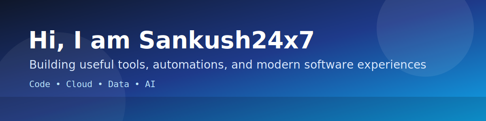



  

<h1 align="center">Sandeep Amerika Kushwaha</h1>

  

  
  
  
  

  
  
  
  

## Executive Snapshot

- Senior Software Developer at Empronc Solutions Pvt. Ltd. (April 2024 to Present).
- Build enterprise modules for procurement, reimbursements, and approval workflows.
- Strong in full-stack delivery with ASP.NET, Angular, SQL Server, and TypeScript.
- Focus areas: production reliability, performance tuning, maintainable architecture, and mentoring.

## Premium Tech Stack

  
  
  
  
  
  
  
  

## Showcase Projects

Reference date: **April 4, 2026**.

| Project | What It Solves | Stack |
|---|---|---|
| [intraclick-sentinel](https://github.com/Sankush24x7/intraclick-sentinel) | Captures click-by-click evidence with screenshots, notes, and report exports. | JavaScript, Chrome Extension |
| [sqlpilot-dba-studio-releases](https://github.com/Sankush24x7/sqlpilot-dba-studio-releases) | Publishes release artifacts for DBA-focused tooling distribution. | Release Ops |
| [LocalSystemProductivityTracker](https://github.com/Sankush24x7/LocalSystemProductivityTracker) | Tracks local productivity signals for desktop usage insights. | C#, .NET |
| [Ollama_SpyTool_Setup](https://github.com/Sankush24x7/Ollama_SpyTool_Setup) | Setup and packaging utilities for Ollama-related tooling workflows. | Rust |
| [security-xray-extension](https://github.com/Sankush24x7/security-xray-extension) | Browser-side security checks and extension-based analysis helpers. | JavaScript |
| [Site-Performance-Detector](https://github.com/Sankush24x7/Site-Performance-Detector) | Measures and reports website performance behavior. | JavaScript |

## Now Building (Roadmap)

- Hardening automation-first developer tools for day-to-day productivity.
- Expanding security and performance browser extensions.
- Improving release packaging and setup experiences for internal products.

## Trust Signals

- Delivered enterprise spend-management modules used across internal business workflows.
- Experience in release support, post-deployment debugging, and QA collaboration.
- Mentored team members and improved development standards through code reviews.

## GitHub Insights

  
  

  
  

  

## Contribution Snake

  

<i>Building practical software with premium quality, every single day.</i>

